# Mitra Engineering Project Report

**Repository:** `Susmita-Dey/mitra`  
**Report Type:** Final-year capstone style + internal engineering design documentation  
**Codebase snapshot analyzed from:** `/home/runner/work/mitra/mitra`  
**Primary app version in repo metadata:** `1.0.0`

---

## 1. Executive Summary

Mitra is a desktop companion application built as a **Tauri v2 + React + TypeScript + Rust** system. Unlike utility-first desktop widgets, Mitra is intentionally designed as a low-friction emotional companion: it remains present, reacts to user context, and delivers gentle reminders (water, stretch, eye break, meals, bio break) with behavior-driven timing and interaction-aware deferrals.

The implementation is separated into clear layers:

- **Product shell + OS integration (Rust/Tauri):** tray, multi-window lifecycle, process inspection, screen geometry, updater plumbing.
- **Frontend runtime engine (TypeScript):** app composition, behavior orchestration, emotion and memory state, reminder scheduling, renderer outputs.
- **Renderer layer:** procedural spring-physics-driven SVG animation rig (instead of heavy GIF/video assets).
- **Persistence + preferences:** browser local storage via typed preference schema with migration hooks.
- **Extensibility:** compiled plugin API with permission declarations and lifecycle hooks.

The architecture is pragmatic, local-first, privacy-oriented, and oriented toward maintainability by separating **semantic intent generation** from **effect execution**.

---

## 2. Product Context and Problem Statement

### 2.1 Problem Being Solved

Knowledge workers commonly lose track of basic wellbeing tasks during long focus periods. Existing reminder systems are often:

- too intrusive,
- context-insensitive,
- emotionally sterile,
- privacy-invasive.

Mitra addresses this through ambient, companion-like interaction:

- idle-aware state transitions (sit/lie/yawn/sleep),
- context-aware reminder deferrals (meeting/focused/hidden windows),
- comeback summaries (catch-up behavior),
- non-blocking visual signaling.

### 2.2 Product Principles Reflected in Code

Principles from `/home/runner/work/mitra/mitra/README.md` and `/home/runner/work/mitra/mitra/CONTRIBUTING.md` appear directly in architecture decisions:

- Companion before productivity
- Privacy by default
- Works mostly offline except constrained weather/location calls
- Delight over feature bloat

### 2.3 Scope

In-scope capabilities in this codebase:

- Multi-window desktop companion (`main`, `settings`, `onboarding`, `tasks`)
- Behavior engine + reminder lifecycle
- Weather, battery, media, meeting/coding process context integration
- Audio cues + procedural visual state
- Plugin framework and examples
- App updater integration

Out-of-scope (at current snapshot):

- Cloud account system
- Multi-user profiles
- Remote telemetry pipelines
- Dynamic plugin loading from untrusted runtime scripts

---

## 3. Technology Stack and Rationale

### 3.1 Frontend

- **React 19** (`/home/runner/work/mitra/mitra/package.json`)
- **TypeScript 5.x** with strict mode (`/home/runner/work/mitra/mitra/tsconfig.json`)
- **Vite 7** (`/home/runner/work/mitra/mitra/vite.config.ts`)

Rationale:

- Fast iterative DX for behavior tuning and rendering iteration.
- Strong type modeling for emotion/intent/interaction enums.
- Easier modular decomposition for engine and systems.

### 3.2 Desktop + Native Integration

- **Tauri v2** with Rust host (`/home/runner/work/mitra/mitra/src-tauri`)
- Rust crates include `tauri`, `serde`, `sysinfo`, `tauri-plugin-updater`, `tauri-plugin-process`.

Rationale:

- Lightweight desktop packaging versus Electron-scale memory footprint.
- Native window and tray controls needed for companion UX.
- Safe native command boundary for process checks and monitor info.

### 3.3 Packaging and Runtime Permissions

- Tauri capability model (`/home/runner/work/mitra/mitra/src-tauri/capabilities/default.json`)
- CSP policy in `/home/runner/work/mitra/mitra/src-tauri/tauri.conf.json`

Rationale:

- Explicit least-privilege declaration for window/updater/process APIs.
- Network scope restricted to weather/location endpoints.

---

## 4. System Architecture Overview

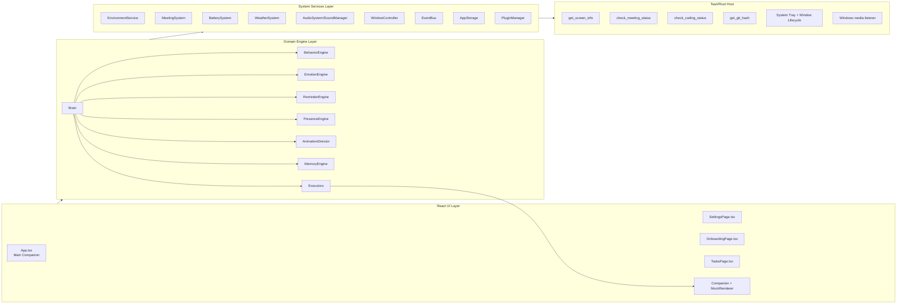

### 4.1 Architectural Style

The codebase implements a hybrid of:

- tick-based game-loop style orchestration (`initializeBrain` 1s cadence), and
- event-driven integration for external signals (Tauri events, event bus, DOM interactions).

### 4.2 Core Separation

- **Intent creation**: behaviors and engines emit semantic intents.
- **Intent execution**: `/home/runner/work/mitra/mitra/src/system/executors.ts` applies effects to animation/emotion/window/audio.

This separation is one of the strongest maintainability decisions in the repository.

---

## 5. Startup and Lifecycle Flows

### 5.1 App Startup Sequence

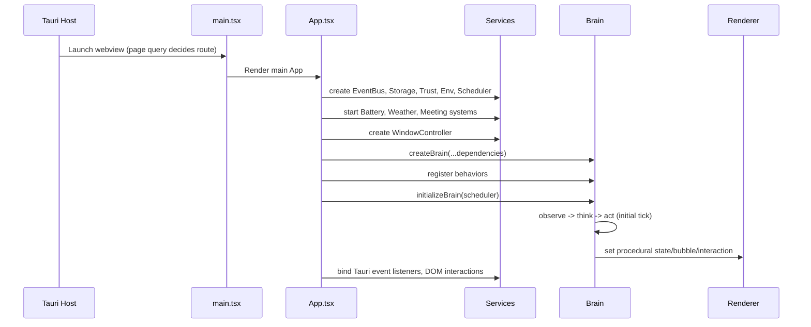

### 5.2 Main Runtime Tick

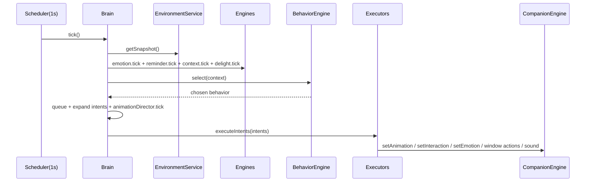

### 5.3 Reminder Trigger and Acknowledge Flow

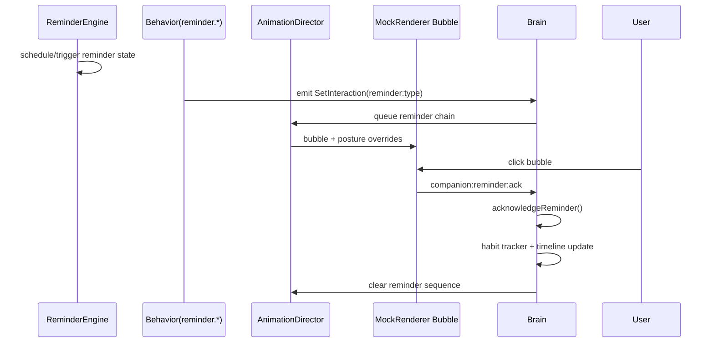

---

## 6. Module Decomposition by Responsibility

### 6.1 App Composition Layer (`/home/runner/work/mitra/mitra/src/app`)

- `App.tsx`: composition root; wires every runtime subsystem.
- `companion-engine.ts`: central external store for character state consumed by React.
- `use-character.ts` + context: sync external store hook and provider.
- `SettingsPage.tsx`, `OnboardingPage.tsx`, `TasksPage.tsx`: supporting windows and preferences/task interactions.

### 6.2 Brain Layer (`/home/runner/work/mitra/mitra/src/brain`)

- `brain.ts`: orchestration center, exposes `observe/think/act` lifecycle.
- Engines:
  - `core/emotion-engine.ts`
  - `reminders/reminder-engine.ts`
  - `presence-engine.ts`
  - `interaction-engine.ts`
  - `celebration-engine.ts`
  - `personality-engine.ts`
  - `delight-engine.ts`
- `core/animation-director.ts`: sequencing, preemption, priority stack for visual/interaction chains.
- `memory.ts` and `memory-engine.ts`: persistent in-memory world history and reminder states.
- `reminders/custom-reminder.ts`: behavior wrapper for custom reminder triggers.

### 6.3 Behavior Layer (`/home/runner/work/mitra/mitra/src/behavior`)

- `behavior-engine.ts`: weighted random selection with:
  - eligibility guards,
  - cooldown filtering,
  - priority bracketing,
  - recency penalty.
- `behaviors/*.ts`: concrete actions (idle, sleep, wake, weather, meeting-hide, catch-up, birthdays, etc.).
- `chains/behavior-chains.ts`: multi-step reminder anticipation scripts.

### 6.4 Body/Renderer Layer (`/home/runner/work/mitra/mitra/src/body`)

- `Companion.tsx`: renderer abstraction interface.
- `MockRenderer.tsx`: interactive SVG character surface.
- `useAnimationRig.ts`: spring-based rig interpolation and bone transforms.

### 6.5 System Services Layer (`/home/runner/work/mitra/mitra/src/system`)

- `scheduler.ts`: centralized timing service.
- `environment-service.ts`: activity/focus/screen snapshot sensor layer.
- `meeting-system.ts`, `weather-system.ts`, `battery-system.ts`, `git-watcher.ts`.
- `audio-system.ts`, `sound-manager.ts`.
- `window-controller-impl.ts`: Tauri window operations and persisted position restore.
- `event-bus.ts` + `event-bus-impl.ts`: typed decoupled events.
- `reminder-parser.ts`: parses natural language inputs and validates safety guidelines.

### 6.6 Native Host Layer (`/home/runner/work/mitra/mitra/src-tauri/src`)

- `lib.rs`: command and plugin registration + setup hooks.
- `system/window.rs`: default bottom-right placement.
- `system/tray.rs`: tray menu and event-driven window toggles.
- `system/meeting.rs`: throttled process scanning via `sysinfo`.
- `system/media.rs`: Windows media session event bridge.
- `system/screen.rs`, `system/git.rs` commands.

---

## 7. Domain Model and Key Data Structures

### 7.1 Core Character Model

Defined in `/home/runner/work/mitra/mitra/src/types/character.ts`:

- `position`
- `animation`
- `emotion`
- `interaction`
- `proceduralState`
- `bubbleText`
- `energy` / `attention`

This model is intentionally lean and render-agnostic.

### 7.2 Intent Model

`/home/runner/work/mitra/mitra/src/types/intent.ts` defines semantic intent union types:

- Character intents (`ChangeEmotion`, `PlayAnimation`, `SetInteraction`, etc.)
- Window intents (`HideWindow`, `ShowWindow`, `SnapToEdge`)
- Audio intents (`PlaySound`)
- Plugin-oriented semantic intents (`ShowSpeechBubble`, `GitCommitDetected`, etc.)

### 7.3 WorldState

`/home/runner/work/mitra/mitra/src/types/world.ts` includes runtime observable world:

- environment snapshot,
- character,
- memory,
- presence,
- settings,
- battery/weather/meeting optional overlays.

### 7.4 Memory Schema

`/home/runner/work/mitra/mitra/src/brain/memory.ts` tracks:

- reminder lifecycle for each reminder type,
- interaction history,
- meeting tracker for deferred reminders,
- lightweight personality vector,
- habit counters.

---

## 8. State Machines

### 8.1 Reminder Lifecycle State Machine

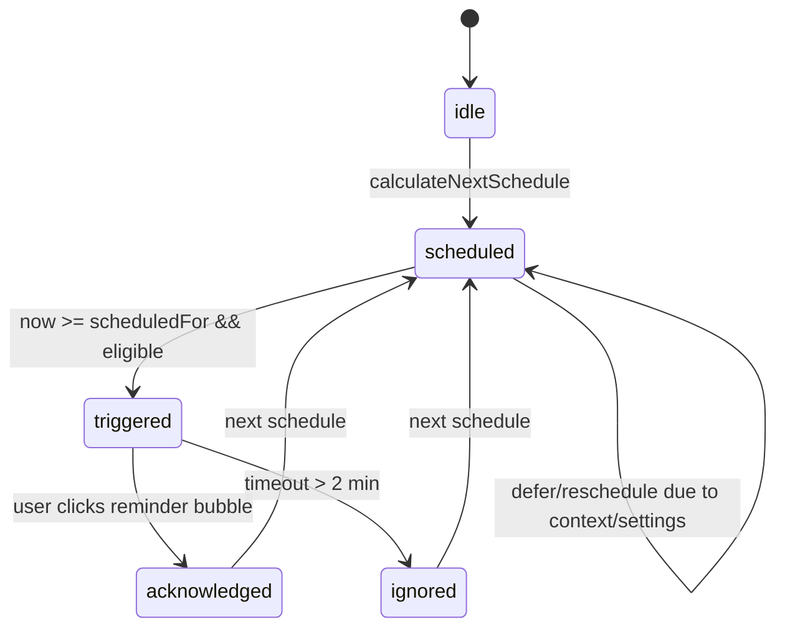

### 8.2 Presence State Machine (Logical)

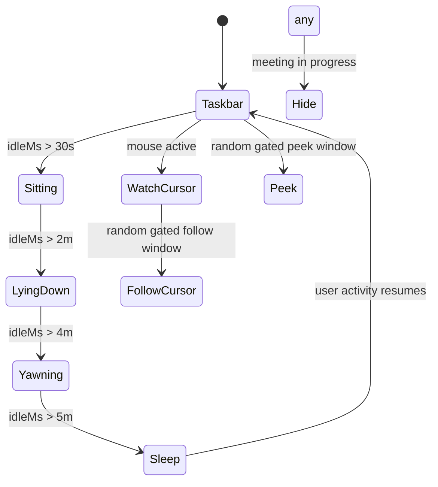

### 8.3 Emotion Transition Rules

Emotion transitions are controlled by:

1. allowed predecessor (`allowedFrom`),
2. interruptibility of current emotion,
3. priority of incoming emotion,
4. optional decay timer.

This is implemented in `/home/runner/work/mitra/mitra/src/brain/core/emotion-engine.ts` using definitions in `/home/runner/work/mitra/mitra/src/brain/emotion-definitions.ts`.

---

## 9. Component and Class-Level Views

### 9.1 Brain Subsystem Component Diagram

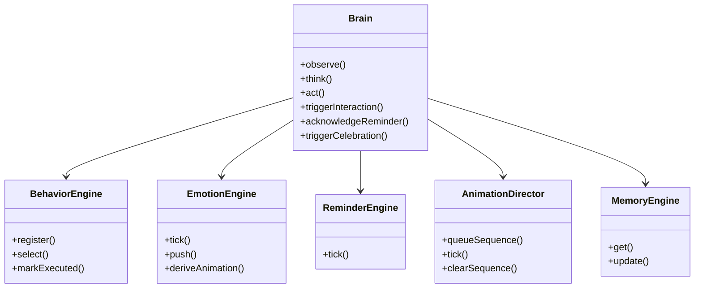

### 9.2 Service Dependency Graph (Main Window)

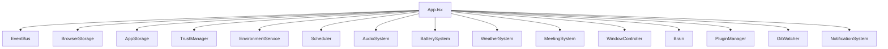

---

## 10. Data Flow Architecture

### 10.1 Primary Data Flow (Observe/Think/Act)

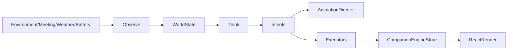

### 10.2 Preference Update Data Flow

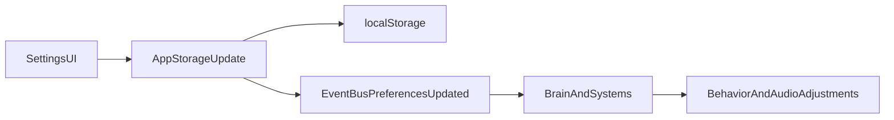

---

## 11. Key Engineering Decisions and Trade-offs

### 11.1 Decision: Tick-Based Orchestration at 1s

- **Chosen:** scheduler-based 1-second brain tick (`initializeBrain`).
- **Pros:** deterministic rhythm, easier reasoning for behavior conflicts.
- **Cons:** coarse temporal granularity for highly responsive micro-interactions.

### 11.2 Decision: Semantic Intents Instead of Direct Mutations in Behaviors

- **Chosen:** behaviors emit typed intents; executors apply effects.
- **Pros:** decoupling, testability, easier plugin safety envelope.
- **Cons:** intent vocabulary must stay coherent as product grows.

### 11.3 Decision: Custom SVG + Procedural Rig

- **Chosen:** in-house spring-rig animation.
- **Pros:** expressive, lightweight assets, dynamic composability.
- **Cons:** higher engineering complexity than sprite sheets.

### 11.4 Decision: Local Storage Preference Persistence

- **Chosen:** browser localStorage abstraction with migration slotting.
- **Pros:** zero backend dependency, instant startup.
- **Cons:** no cross-device sync.

### 11.5 Decision: Process-Based Meeting/Coding Detection

- **Chosen:** throttled `sysinfo` process scans.
- **Pros:** no invasive API hooks; straightforward cross-platform adaptation.
- **Cons:** heuristic by process names; can produce false negatives.

### 11.6 Decision: Local Input Safety & Guardrails for Adaptive Behaviors

- **Chosen:** Regex-based, local, offline content safety filtering for custom reminders.
- **Pros:** instant, network-free, zero-telemetry response. Empathizes or redirects prompts to match the role of a supportive desktop companion.
- **Cons:** limited scope of detection compared to cloud-based LLM safety classification.

---

## 12. Security and Privacy Engineering

### 12.1 Threat Surface Summary

- Native command invocation boundary (Tauri commands)
- Window privilege controls
- Network calls for weather/geolocation
- Plugin extension surface

### 12.2 Controls Present in Current Code

1. **Tauri capability restrictions** in `/home/runner/work/mitra/mitra/src-tauri/capabilities/default.json`
2. **CSP network constraints** in `/home/runner/work/mitra/mitra/src-tauri/tauri.conf.json`
3. **No dynamic eval-based plugin loading** (plugins are compiled TS)
4. **Privacy-conscious environment snapshot** (no key content/window titles/cursor coordinates)
5. **Minimal command set** in Rust (`get_screen_info`, `check_meeting_status`, `check_coding_status`, `get_git_hash`)
6. **Local safety filtering** inside natural language command parser to block self-harm, violent, or illegal reminder schedules.

### 12.3 Security Gaps / Recommendations

- Introduce formal plugin permission enforcement for event subscription path (`events` permission currently not explicitly guarded in manager).
- Add stronger schema validation for persisted preference payloads before merge.
- Add explicit timeout and retry policy wrappers around weather and location fetches.

### 12.4 Software Development Lifecycle (SDLC) Model

Mitra was engineered using an **Evolutionary Iterative Prototyping** lifecycle model. This methodology is highly suited for a desktop companion application where user interaction physics, animation fluidities, and native OS integrations require continuous micro-adjustments and verification:

1. **Iterative Feature Increments**: Development progressed from visual prototypes (procedural skeletal rig in v0.1) to responsive contexts (meeting detection, media vibe in v0.2), to full system integration (DPI geometry, auto-updates in v0.9), and finally custom reminders and safety guardrails (v1.0).
2. **Risk-Driven Mitigations**: Each iteration began with a risk assessment stage analyzing performance, memory leaks, and capability boundaries (e.g. process checking CPU overhead mitigated by 30s cache; unmanaged setTimeout leak mitigated by custom hook refs).
3. **Verification-Driven Release Cycles**: Every cycle was verified through a dedicated validation gate (`FINAL_PRODUCTION_VERIFICATION.md`), aligning with the verification-validation principles of the V-Model.

#### SDLC Flow Diagram

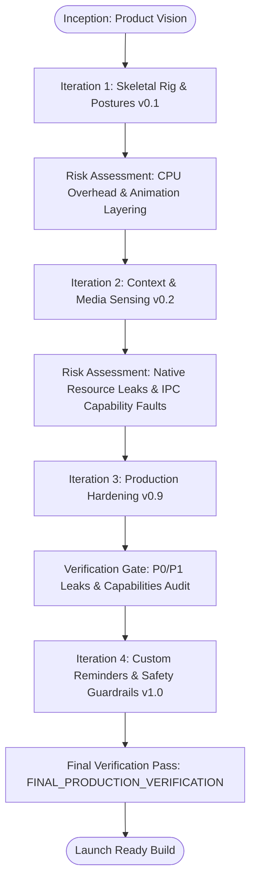

---

## 13. Performance Characteristics

### 13.1 CPU and Scheduling

- Centralized scheduler avoids unbounded timer spread.
- Meeting checks aligned to 30s cadence (and Rust-side throttled refresh) reduce scanning overhead.

### 13.2 Render Performance

- 60fps procedural updates in `useAnimationRig.ts` with spring interpolation.
- Single renderer path in `MockRenderer.tsx` currently active.

### 13.3 I/O and Storage

- Debounced window position persistence in `window-controller-impl.ts` prevents write storms.
- Preference update/publish pattern is direct and simple.

### 13.4 Audio

- Preloaded audio buffers reduce playback latency.
- Cooldown logic suppresses repetitive sound emissions.

---

## 14. Reliability and Failure Handling

### 14.1 Defensive Patterns Observed

- Many integrations are fail-soft (`try/catch` and warning logs).
- Weather and meeting APIs degrade gracefully when unavailable.
- Non-Tauri/browser dev fallback in environment service.

### 14.2 Lifecycle Cleanup

The codebase has explicit cleanup across:

- Tauri listeners,
- DOM listeners,
- weather/battery intervals and event handlers,
- plugin subscriptions and registries,
- scheduler disposal.

### 14.3 Known Reliability Risks

- Mixed use of scheduler and raw `setInterval` in some systems (`git-watcher`, `weather-system`) could be standardized.
- Some plugin API paths reference fields (`scheduler`, intent evaluation bridge) that should be contract-audited for long-term correctness.

---

## 15. Testing and Verification Strategy

### 15.1 Current State

The repository currently emphasizes:

- TypeScript compile/build checks,
- Rust build validation,
- manual/QA verification captured in `/home/runner/work/mitra/mitra/FINAL_PRODUCTION_VERIFICATION.md`.

There is no large automated unit/integration test suite in current snapshot.

### 15.2 Recommended Automated Strategy

1. **Unit tests**
   - behavior selection and cooldown logic
   - reminder scheduling transitions
   - emotion transition guard semantics

2. **Contract tests**
   - intent execution mapping
   - plugin permission enforcement

3. **Integration tests (headless/webview harness)**
   - startup wiring and disposal behavior
   - window event flows (hide/show/catch-up)

4. **Rust command tests**
   - command serialization and fallback values
   - process-name matching behavior with fixtures

### 15.3 Manual Scenario Regression Suite

- onboarding path
- settings persistence
- reminder trigger + ack + deferral
- meeting hide/unhide
- weather prop changes
- task completion celebration
- update-check command from tray

---

## 16. Deployment, Packaging, and Release Architecture

### 16.1 Build Pipeline

Configured through:

- `/home/runner/work/mitra/mitra/package.json` scripts
- `/home/runner/work/mitra/mitra/src-tauri/tauri.conf.json` build directives

Build flow:

1. TS compile + Vite build,
2. Tauri bundles with frontend dist,
3. native installers per platform target.

### 16.2 Auto Update

- Tauri updater plugin enabled with endpoint to GitHub release artifact metadata.
- Frontend component `Updater.tsx` triggers checks and restart flow via process plugin relaunch.

### 16.3 Multi-Window Deployment Model

Windows configured in tauri config:

- `main` companion,
- `settings`,
- `onboarding`,
- `tasks`.

---

## 17. Scalability and Future Evolution

### 17.1 Functional Scalability

Current architecture scales well in feature count because:

- behaviors are pluggable modules,
- systems are decoupled by interfaces,
- state effects flow through typed intents.

### 17.2 Team Scalability

Folder-based ownership boundaries are clear enough for parallel work:

- brain/behavior team,
- renderer/animation team,
- native integrations team,
- settings/preferences team.

### 17.3 Technical Debt Hotspots

- Add comprehensive test harness for behavior and reminder state transitions.
- Tighten plugin API correctness/permission checks.
- Standardize all periodic tasks via scheduler abstraction.

---

## 18. Product Roadmap (Engineering-Backed)

### 18.1 Near-Term

1. Introduce deterministic seeded randomness option for reproducible QA.
2. Expand reminder analytics in local-only dashboard (privacy-preserving).
3. Harden plugin lifecycle contract and registry introspection tools.

### 18.2 Mid-Term

1. Cross-platform media integrations beyond Windows.
2. Improved context sensing (fullscreen, app category inference with explicit user consent).
3. Additional character renderers (`rive`, `svg`) using current abstraction.

### 18.3 Long-Term

1. Optional encrypted cloud sync (opt-in only) for preferences/habit streaks.
2. Multi-companion personality packs and modular behavior bundles.
3. Advanced local AI-assisted dialogue layer preserving offline-first operation.

---

## 19. Risk Register and Mitigation Matrix

| Risk | Current Exposure | Mitigation in Place | Recommended Next Step |
|---|---|---|---|
| Reminder mis-timing | Medium | reminder state machine + jitter/deferral guards | add deterministic tests for schedule math |
| Plugin misuse | Medium | typed API + compiled plugins | strict permission checks at every facade path |
| OS process heuristic drift | Medium | suffix normalization + throttled checks | configurable process match list by OS |
| Audio fatigue | Low/Medium | category cooldowns + quiet hours | per-user adaptive sound frequency |
| State schema drift | Medium | version field + migration scaffold | add schema validation pre-merge |
| Event listener leaks | Low | explicit dispose patterns | add lifecycle tests to CI |

---

## 20. Engineering Quality Assessment

### 20.1 Strengths

- Clear orchestration model (`observe -> think -> act`)
- Strong modular decomposition
- Explicit intent-driven side effect boundary
- Rich UX behavior logic without backend dependency
- Practical privacy-conscious sensor model

### 20.2 Weaknesses

- Automated testing depth currently limited
- Some plugin pathways require stronger contract guarantees
- Several advanced behaviors rely on randomness, reducing deterministic reproducibility unless seeded

### 20.3 Overall Assessment

For a capstone + production-oriented internal design artifact, Mitra demonstrates:

- excellent architectural intent,
- meaningful systems engineering tradeoffs,
- real-world desktop integration complexity,
- strong maintainability direction.

The next maturity step is test automation and stricter extension-surface hardening.

---

## 21. Appendix A — Key File Inventory (Critical Paths)

### Frontend Core

- `/home/runner/work/mitra/mitra/src/main.tsx`
- `/home/runner/work/mitra/mitra/src/app/App.tsx`
- `/home/runner/work/mitra/mitra/src/app/companion-engine.ts`

### Brain + Behavior

- `/home/runner/work/mitra/mitra/src/brain/brain.ts`
- `/home/runner/work/mitra/mitra/src/behavior/behavior-engine.ts`
- `/home/runner/work/mitra/mitra/src/brain/reminders/reminder-engine.ts`
- `/home/runner/work/mitra/mitra/src/brain/core/animation-director.ts`

### Renderer

- `/home/runner/work/mitra/mitra/src/body/MockRenderer.tsx`
- `/home/runner/work/mitra/mitra/src/body/useAnimationRig.ts`

### Native

- `/home/runner/work/mitra/mitra/src-tauri/src/lib.rs`
- `/home/runner/work/mitra/mitra/src-tauri/src/system/tray.rs`
- `/home/runner/work/mitra/mitra/src-tauri/src/system/meeting.rs`

---

## 22. Appendix B — Suggested Ownership Map

| Area | Suggested Owner Group |
|---|---|
| `src/brain` + `src/behavior` | Companion Intelligence team |
| `src/body` | Rendering & Motion team |
| `src/system` | Platform Services team |
| `src-tauri/src/system` | Native Runtime team |
| `src/plugin` | Ecosystem/Extensibility team |
| `src/app` + settings/onboarding/tasks | Product Surface team |

---

## 23. Appendix C — Diagram Index

1. System architecture overview
2. Startup sequence diagram
3. Main runtime tick sequence
4. Reminder trigger/ack sequence
5. Reminder state machine
6. Presence state machine
7. Brain class/component diagram
8. Main data flow diagram
9. Preference update data flow

---

## 24. Conclusion

Mitra is a thoughtfully engineered desktop companion architecture with a clear decoupling strategy, privacy-aware sensing model, expressive procedural rendering, and concrete production-focused native integration. The project already contains many qualities expected in a mature internal engineering design: explicit subsystem boundaries, deterministic orchestrator loops, capability-scoped native APIs, and clear extensibility hooks.

To reach top-tier product-company operational rigor, the immediate next investment should be a robust automated test matrix and stricter extension surface contracts.

---

## 25. Detailed Behavior Inventory and Decision Matrix

The table below maps concrete behaviors to their purpose, trigger predicates, and side effects. Behavior implementations live under `/home/runner/work/mitra/mitra/src/behavior/behaviors` (plus reminder wrappers in `/home/runner/work/mitra/mitra/src/brain/reminders`).

| Behavior ID (or file) | Trigger Class | Primary Predicate | Representative Intents |
|---|---|---|---|
| `idle.ts` | Ambient | fallback/default eligible behavior | `PlayAnimation(idle)` |
| `blink.ts` | Ambient micro-motion | random/idle cadence | `PlayAnimation(blink or double-blink)` |
| `look-around.ts` | Ambient awareness | idle and eligible cooldown | `PlayAnimation(look-around)` |
| `stretch.ts` | Ambient | idle cycle progression | `PlayAnimation(stretch)` |
| `sleep.ts` | Presence-derived | presence or emotion conditions for sleep | `Sleep`, emotion adjustments |
| `wake.ts` | Presence-derived | user activity resumed or sleep exit | `Wake`, emotion adjustments |
| `walk.ts` | Ambient movement | movement opportunity gates | `PlayAnimation(walk)` |
| `observe.ts` | Ambient/Reactive | attention shift opportunities | `Observe` |
| `yawn.ts` | Ambient fatigue | idle/time context | `Yawn` |
| `look-at-cursor.ts` | Reactive | cursor proximity/activity context | interaction + animation cues |
| `boot-greet.ts` | Lifecycle | first-run or not greeted state | `Greet`, initial bubble |
| `sit.ts` | Presence-derived | moderate idle stage | posture/animation set |
| `battery.ts` | Context reactive | low battery thresholds | bubble/emotion alerts |
| `battery-full.ts` | Context reactive | charging complete | celebration-like cues |
| `time-routine.ts` | Time-context | late night or early morning | `ChangeEmotion` + `PlayAnimation` |
| `weather.ts` | Environment context | weather state available and meaningful | prop/interactions updates |
| `meeting-hide.ts` | System-critical | meeting on/off transitions | `HideWindow` / `ShowWindow` |
| `presence-lie-down.ts` | Presence-derived | idle phase progression | posture set |
| `presence-watch-cursor.ts` | Presence-derived | active mouse track state | watch interaction |
| `presence-follow-cursor.ts` | Presence-derived | gated follow-cursor random window | movement behavior |
| `presence-peek.ts` | Presence-derived | random peek windows | peek animation/state |
| `presence-wander.ts` | Presence-derived | short idle random wander | wander animation |
| `presence-taskbar.ts` | Presence-derived fallback | default waking state | taskbar-presence pose |
| `catch-up.ts` | Recovery behavior | hidden/meeting-deferred reminders exist | summary bubble + sound |
| `user-birthday.ts` | Date context | user birthday equals today | celebration intent |
| `mitra-birthday.ts` | Date context | companion birthday equals today | celebration intent |
| `reminder.water` etc. | Reminder lifecycle | corresponding reminder `state=triggered` | `SetInteraction(reminder:*)` |

### 25.1 Behavioral Priority Bands in Practice

The architecture uses practical priority bands via `BehaviorDefinition.priority`:

- **100+**: critical/system safety UX (meeting hide)
- **80-99**: high-value contextual actions (reminder display)
- **50-79**: reactive social/context behaviors
- **0-49**: ambient and decorative routines

Weighted random is used **only inside top active band**. This preserves deterministic urgency while preserving variety.

---

## 26. Sequence Diagram Pack (Expanded)

### 26.1 Settings Save Propagation

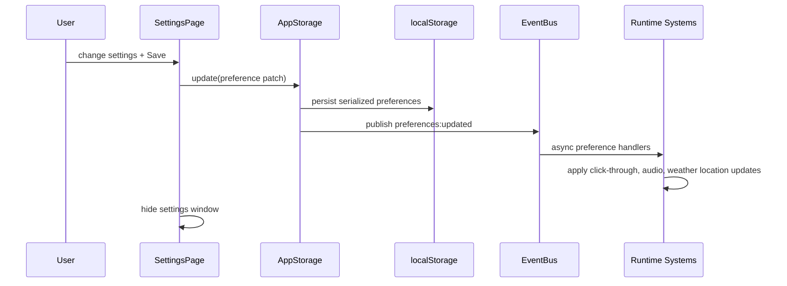

### 26.2 Meeting Detection to Window Hide

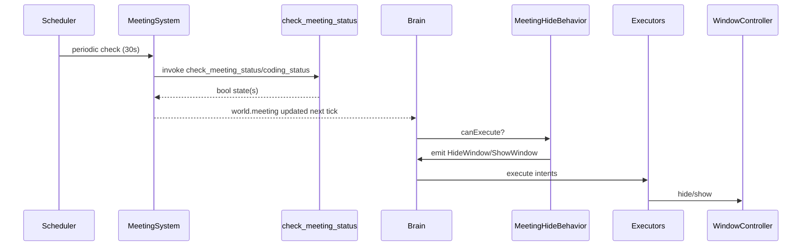

### 26.3 Update Install and Relaunch

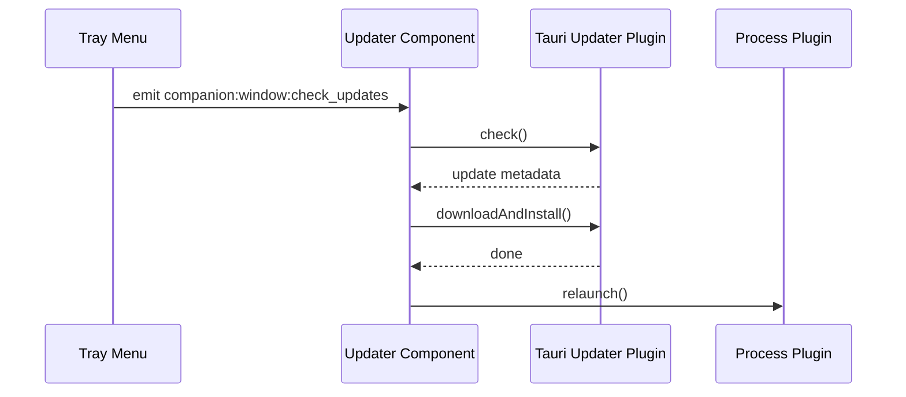

### 26.4 Plugin Initialization Path

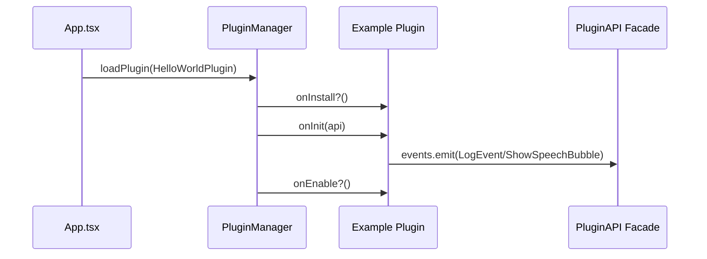

---

## 27. Data Flow Diagram (DFD) Levels

### 27.1 DFD Level 0 (Context Diagram)

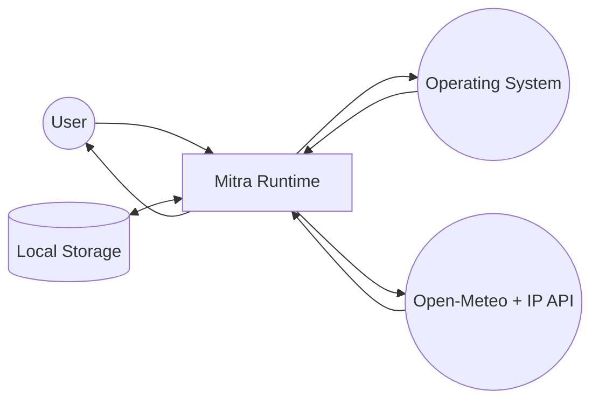

### 27.2 DFD Level 1 (Internal Subsystems)

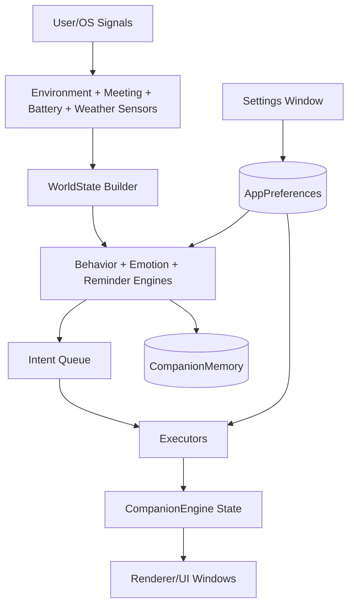

### 27.3 DFD Level 2 (Reminder Subflow)

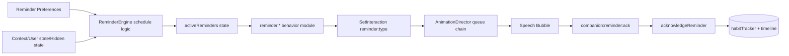

---

## 28. State Model Deep Dive

### 28.1 Character State Axes

Character state in `/home/runner/work/mitra/mitra/src/types/character.ts` is intentionally orthogonal:

- `animation` (motion channel)
- `emotion` (mood channel)
- `interaction` (current scenario channel)
- `position` (window/placement channel)
- `proceduralState` (high-resolution render channel)

Orthogonality allows one channel change without side effects on unrelated channels.

### 28.2 Reminder State Design

Reminder items are explicit and enumerable (`water/stretch/eyes/lunch/dinner/snack/bio`). The design intentionally avoids generic dynamic reminder entities to keep reasoning deterministic and allow direct preference controls per reminder type.

### 28.3 Personality State Design

Personality vector (`playful/curious/shy/gentle/energetic/sleepy`) uses small adaptation and decay rates. This yields long-term behavior drift without unstable oscillations.

### 28.4 Timeline State Design

Timeline events are bounded (`maxEvents=100`) for memory safety and are suited for:

- debugging progression,
- generating future explainability UI,
- deriving retrospective summaries.

---

## 29. Engineering Decisions by Quality Attribute

## 29.1 Maintainability

- interfaces separate contracts and implementations (`EnvironmentService`, `WindowController`, `Storage`, `SchedulerService`).
- barrel exports simplify dependency surfaces.
- behavior modules keep feature additions local.

## 29.2 Performance

- 1-second orchestrator avoids over-ticking decision logic.
- microtask event bus prevents sync cascades.
- native process refresh throttled at Rust layer.

## 29.3 Security/Privacy

- capability and CSP constraints.
- no telemetry ingestion pipeline in codebase.
- environment snapshot excludes sensitive content.

## 29.4 Reliability

- many service methods degrade gracefully.
- explicit dispose hooks reduce leak risk.
- fallback paths for non-tauri execution where feasible.

## 29.5 Extensibility

- plugin manifest and permission model.
- `registerBehavior` support for plugin-contributed logic.
- typed event integration points.

---

## 30. Testing Blueprint (Concrete and Code-Linked)

### 30.1 Unit test targets

1. `/home/runner/work/mitra/mitra/src/behavior/behavior-engine.ts`
   - priority bracket selection
   - cooldown blocking
   - recency penalty effect

2. `/home/runner/work/mitra/mitra/src/brain/reminders/reminder-engine.ts`
   - schedule generation interval/time modes
   - focus/meeting deferrals
   - timeout to ignored transitions

3. `/home/runner/work/mitra/mitra/src/brain/core/emotion-engine.ts`
   - allowedFrom guard
   - interruptibility and priority overrides
   - decay tick behavior

4. `/home/runner/work/mitra/mitra/src/system/scheduler.ts`
   - due task ordering by priority
   - recurring task cadence
   - cancellation safety

### 30.2 Integration test targets

1. app composition startup/disposal (`App.tsx`)
2. event listener cleanup on unmount
3. settings write and preference propagation
4. reminder bubble acknowledgment end-to-end
5. meeting hide and catch-up show path

### 30.3 Native tests

- command serialization contracts in `screen.rs` and `meeting.rs`
- process name matching fixtures across OS patterns
- media listener smoke checks on Windows path

### 30.4 Regression checklist linked to code modules

- `/home/runner/work/mitra/mitra/src/body/MockRenderer.tsx`: all pointer interaction events still dispatch expected names
- `/home/runner/work/mitra/mitra/src/system/window-controller-impl.ts`: position restore works for disconnected monitors
- `/home/runner/work/mitra/mitra/src/brain/brain.ts`: intent queue clears each tick and no stale carry-over

---

## 31. Performance Engineering Plan

## 31.1 Current baseline opportunities

- Profile render frame loop in `useAnimationRig.ts` with heavy prop combinations.
- Track CPU cost of reminder behavior and animation director queue churn.
- Evaluate weather/geolocation fetch resilience under poor network.

## 31.2 Optimization candidates

1. memoize expensive per-frame calculations in rig path.
2. move `git-watcher` from `setInterval` to centralized scheduler.
3. reduce redundant object spread allocations in hot tick path where possible.
4. defer non-critical plugin initialization until after first stable render.

## 31.3 Measurement instrumentation recommendations

- lightweight internal counters on tick duration p50/p95.
- debug mode timeline event for long frame/tick warnings.
- optional dev overlay to show current active sequence and queue depth.

---

## 32. Security Threat Model (STRIDE-Oriented)

| Threat | Relevant Surface | Current Mitigation | Hardening Proposal |
|---|---|---|---|
| Spoofing | Plugin identity | Manifest IDs and compile-time inclusion | signed plugin bundle policy for external ecosystem |
| Tampering | localStorage preferences | typed defaults + deep merge | schema validation + integrity checksum |
| Repudiation | action tracking | timeline entries | append-only audit mode for debug builds |
| Information disclosure | environment sensing | no key text/window title capture | maintain strict privacy review gate for new sensors |
| Denial of service | listener/timer leaks | dispose patterns and scheduler centralization | lifecycle tests in CI |
| Elevation of privilege | Tauri permissions | explicit capability list | periodic capability review and minimization |

---

## 33. Deployment and Operations Handbook

## 33.1 Build artifacts

- frontend build output to `dist`
- native bundles via Tauri targets configured in `/home/runner/work/mitra/mitra/src-tauri/tauri.conf.json`

## 33.2 Release gating

Recommended release gates:

1. TypeScript compile and build pass.
2. Rust compile pass per platform matrix.
3. critical manual scenario suite pass.
4. update flow smoke test.
5. capability/CSP diff review.

## 33.3 Operational telemetry posture

Current product is local-first with no remote user telemetry subsystem. Operational insight relies on local logs and manual QA; introducing telemetry should remain opt-in and privacy reviewed.

---

## 34. Refactoring Opportunities by ROI

### High ROI

1. isolate event-binding blocks in `App.tsx` into dedicated lifecycle hooks.
2. add integration tests around reminder/catch-up flow.
3. standardize all periodic tasks on scheduler service.

### Medium ROI

1. split `MockRenderer.tsx` into subcomponents for hitzones/body/props/head.
2. introduce typed command bus between brain and renderer for stronger compile-time guarantees.
3. add richer plugin permission checks for all facade methods.

### Lower ROI / future

1. alternate renderer implementations (`rive`/`svg`) behind existing `Companion.tsx` contract.
2. optional persisted memory snapshots.

---

## 35. Future Scope and Research Directions

## 35.1 Product evolution

- richer social routines (weekend/holiday packs)
- adaptive reminder intervals using local behavior feedback
- optional lightweight conversational layer with on-device model

## 35.2 Engineering evolution

- deterministic simulation mode for behavior regression tests
- formal event catalog docs and versioning
- stronger domain boundaries via package-level layering rules

## 35.3 Platform evolution

- macOS/Linux media integrations to match Windows path
- optional cross-device sync with encrypted preference payloads

---

## 36. Appendix D — Component Ownership and RACI Snapshot

| Component | Responsible | Accountable | Consulted | Informed |
|---|---|---|---|---|
| Brain + Behavior engines | Companion Intelligence Eng | Engineering Lead | Product + UX | QA |
| Renderer + Rig | Motion/Graphics Eng | Engineering Lead | Product + UX | QA |
| Native Tauri integrations | Native Platform Eng | Engineering Lead | Security | Product |
| Storage + Preferences | Runtime Platform Eng | Engineering Lead | Product | QA |
| Plugin subsystem | Platform Ecosystem Eng | Engineering Lead | Security | Product |

---

## 37. Appendix E — Glossary

- **CompanionEngine:** external store for character render state.
- **WorldState:** consolidated snapshot used by behaviors.
- **Intent:** semantic action emitted during think phase.
- **AnimationDirector:** sequence priority controller for procedural state and bubbles.
- **PresenceState:** logical companionship mode (taskbar/sit/lie/sleep/etc.).
- **Catch-up behavior:** summary interaction after hidden/meeting period.

---

## 38. Final Engineering Verdict

From an internal design-review perspective, Mitra is not a toy architecture: it includes real desktop runtime constraints, stateful behavior orchestration, cross-layer intent routing, and practical native capability management. The design is good enough to teach production architecture patterns in a capstone setting and credible enough to evolve into a maintainable product with modest targeted investments in automated testing and extension-surface hardening.

