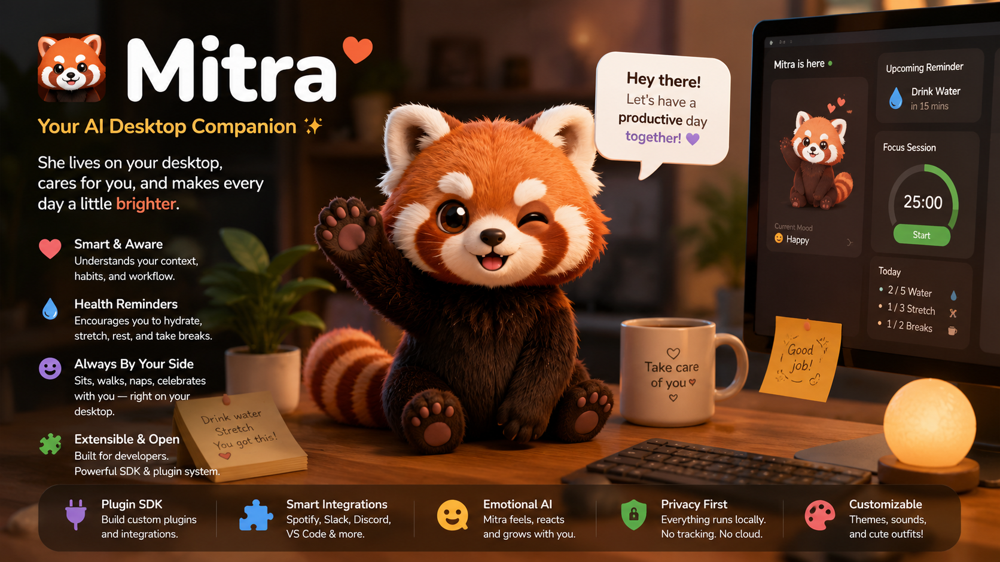

# 🦊 Mitra

  

 

> _**Your tiny open-source desktop companion.**_

Mitra quietly lives on your desktop while you work.

No accounts. No tracking. No guilt. Just a little Red Panda companion that gently reminds you to take care of yourself.

---

## 📥 Installation

Mitra is available for Windows, macOS, and Linux!

1. Go to the [Releases Page](../../releases) (or simply download from our Product Hunt launch link).
2. Download the installer for your system:
   - **Windows**: Download the `.exe` or `.msi` file and run it.
   - **macOS**: Download the `.dmg` file and drag Mitra into your Applications folder.
   - **Linux**: Download the `.deb` or `.AppImage` file.
3. Open the app and meet your new companion!

---

## 🕹️ How to Use (Zero Learning Curve)

Mitra is designed to be completely out of your way until you need her. There are no complicated settings or dashboards.

- **Drag anywhere**: Click and hold to drag her anywhere on your screen.
- **Interactions**: Try clicking on her tummy, her paws, or giving her a high-five! She has a custom physics-based animation system that makes her respond dynamically to your interactions.
- **Reminders**: She will automatically know when it's time for lunch, dinner, or when you need a stretch. When she gives you a reminder bubble, you can click the bubble to dismiss it.
- **🎵 Music Vibes**: She listens along to your music (Windows-only) and enjoys the tunes with you!
- **🤫 Meeting Privacy**: She intelligently detects when you're on a Zoom or Teams call and stays completely out of the way.
- **💻 Coding Buddy**: She detects when your IDE is open (VS Code, JetBrains) and silently cheers you on!
- **Weather & Battery**: She fetches local weather to know when to hold an umbrella, and she does a happy dance when your laptop battery hits 100%!
- **Settings**: Right-click the system tray icon (down in your taskbar) to open Settings or toggle Compact Mode.

---

## Why Mitra?

We've all experienced it. You start working. Minutes turn into hours. You forget to:

- 💧 Drink water
- 👀 Rest your eyes
- 🤸 Stretch
- 🚶 Walk around
- 🍽️ Eat lunch

Mitra doesn't interrupt you with annoying notifications. Instead, she quietly exists beside you like a tiny companion. When the moment feels right, Mitra gently interacts with you. No pressure. No productivity hacks. Just a friendly reminder that you're human.

---

## Principles

- ❤️ Companion before productivity
- 🔒 Privacy by default
- 🌐 Works completely offline (Local weather is fetched without OS tracking!)
- 🧠 Smart enough to wait
- ✨ Delight over features

---

## Tech Stack

- **Backend**: Rust & Tauri v2
- **Frontend**: React & TypeScript
- **Animations**: Custom 60fps Procedural Spring Physics Engine (No heavy GIFs/Videos!)

---

## License

Mitra is licensed under the [MIT License](LICENSE).